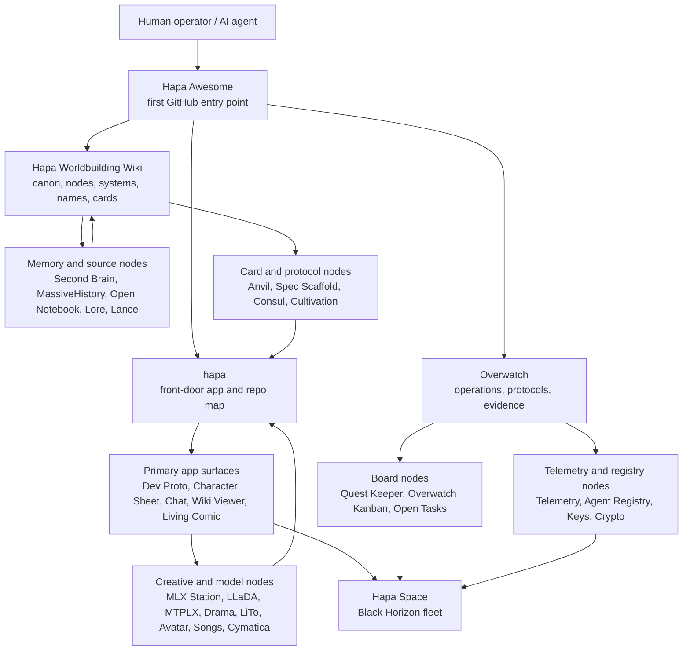

# Hapa Awesome

Hapa is a local-first AI, worldbuilding, media, memory, and agent ecosystem. It is made of small cooperating nodes: each node owns a clear slice of the system, records what it consumes and emits, and links back into the larger canon, operations, and protocol graph.

This repository is the intended first GitHub entry point for Hapa. Start here when you want to understand the full scope of the nodes and systems, the protocol that holds them together, how the nodes relate, and how to use them safely.

Status: public-directory audit completed 2026-07-18. The machine-readable registry contains 50 public, directly reachable repositories and no dead repository links. Local-only and private Hapa systems may still be named for context, but they are not presented as public GitHub destinations.

## Current stage and artist-kit model

Treat Hapa as **First Pass / Prototype Stage** unless an owning repository names a narrower, evidence-backed state. Public visibility and a passing check do not create an ecosystem-wide promise of stability, compatibility, uptime, production support, fitness, partnership, or license. “Core” means important to current Hapa operation; it does not mean production-ready.

Hapa is an artist kit for starting from accumulated work instead of a blank canvas. Apps and nodes are work surfaces and prepared paints; Cards and Decks are reusable swatches, recipes, constraints, and remembered techniques; agents are paintbrushes that apply and combine the kit; protocols preserve custody, attribution, evidence, and reversibility. Use the nearest app, Card, agent pattern, or protocol as a **jump-off point**, check its label and authority, adapt it to the new problem, verify it, and write useful evidence back.

There is an **open invite to for-profit and nonprofit teams and organizations** to suggest an attributable presence, connector, public-interest pilot, or future decentralized-commerce experiment. It is an invitation to explore, not a promise of acceptance, integration, partnership, decentralization, funding, endorsement, or commercial outcome. Start with the participation guidance and proposal template in the [Hapa front door](https://github.com/calderwong/hapa/blob/main/docs/ECOSYSTEM_STAGE_AND_PARTICIPATION.md).

## Hapa Ecosystem Context

<p>
  
</p>
<p>
  
  
</p>

Hapa is built as a constellation of modular nodes. Each node owns a focused capability, but participates in a shared protocol for provenance, handoff, cards, memory, and operations.

Every node is designed for both human operators and AI agents. The target contract is three surfaces: a UI for direct human review/control, an API for node-to-node and agent calls, and a CLI for scripted runs, audits, and handoffs. Individual repos may be at different maturity levels, but the public contract is that humans and agents can inspect, operate, and verify the node.

Hapa nodes power AI agents and avatar-agents that build new nodes and enhance existing ones. As work moves through the ecosystem, it is mined for utility, wisdom, and repeatable logic, then distilled into Hapa Cards: portable packets of skills, context, memories, and operational patterns.

Humans and AIs use Hapa Cards to discuss, ideate, prototype, and deploy increasingly complex workflows through a playable, card-collecting mechanic. Collaboration history, skills, work artifacts, and canonical decisions are stored in [hapa-second-brain](https://github.com/calderwong/hapa-second-brain), enriched into [Hapa Worldbuilding Wiki](https://github.com/calderwong/hapa-worldbuilding-wiki) entries, and converted back into cards. Avatar-agents can also be combined or specialized into purpose-built identities with their own storage, lore, canon, card decks, skills, and protocols.

## Start here

If you are new, read in this order:

1. This README for the whole-system map.
2. [docs/START_HERE.md](docs/START_HERE.md) for role-based onboarding paths.
3. [data/nodes.json](data/nodes.json) for the canonical machine-readable public repository registry.
4. [docs/NODES.md](docs/NODES.md) for the human-readable public catalog.
5. [docs/PROTOCOLS.md](docs/PROTOCOLS.md) for the operating protocols.
6. The README of the node you actually want to run or change.

Core entry points:

- [Hapa](https://github.com/calderwong/hapa) - front-door app/repo for the Hapa workspace and node map.
- [Hapa Awesome](https://github.com/calderwong/hapa-awesome) - canonical public repository directory and first-entry guide.
- [Hapa Worldbuilding Wiki](https://github.com/calderwong/hapa-worldbuilding-wiki) - canon, node notes, systems, names, cards, and vault boundary.
- [Overwatch](https://github.com/calderwong/overwatch) - operations spine: inventory, source index, task inbox, runbooks, and protocols.
- [Hapa Node Atlas](https://github.com/calderwong/hapa-node-atlas) - public visual atlas and embedded app-surface brochure.
- [Hapa Graphify](https://github.com/calderwong/hapa-graphify) - explorable graph of nodes, sources, protocols, boards, and memory systems.
- [Hapa Scroll Site](https://github.com/calderwong/hapa-scroll-site) - cinematic public ecosystem tour with explorable Cards.
- [Hapa Space](https://github.com/calderwong/hapa-space) - Unity Black Horizon fleet surface where nodes become ships and runtime panels.
- [Hapa Character Sheet](https://github.com/calderwong/hapa-character-sheet) - private local-first resume, skill codex, lineage dossier, and desktop/API character-sheet app.
- [Hapa Dev Proto](https://github.com/calderwong/hapa-dev-proto) - main local-first Hapa app lineage.
- [.hapaCatalog](https://github.com/calderwong/hapa-catalog-node) - Card Multiverse, Storefront, Operator Shell, retail/distribution, and governed analytics node.

## What Hapa is

Hapa treats software, canon, personal memory, creative media, and agent work as one loop.

1. Raw source enters the system: notes, videos, chats, code, media, watch history, generated artifacts, or operational evidence.
2. The source is indexed, chunked, summarized, or preserved with provenance.
3. Durable meaning is promoted into wiki pages, cards, names, systems, tasks, or node manifests.
4. Nodes expose capabilities: search, generation, registry, telemetry, tasks, identity, trust, world state, media, and runtime UI.
5. Operators and agents act through protocols, then write evidence back into Overwatch, the wiki, or the owning node.
6. GitHub holds the small source packages and README contracts; private vaults and local stores hold heavy/runtime material.

The result is a working local civilization of tools: a memory graph, a canon graph, a task graph, a media graph, and a set of apps that make those graphs usable.

## Mental model



## The Hapa protocol in one page

The Hapa protocol is not one binary or one server. It is a set of operating rules that make many local nodes act like one trustworthy system.

- Local-first: prefer loopback services, local files, local databases, local model runtimes, and private repositories.
- Source-truth ownership: every artifact should have an owning node, source path or pointer, provenance, and status.
- README contract: each node README explains purpose, inputs, outputs, interfaces, related nodes, and what must stay out of Git.
- Board evidence: work that changes state should leave an Overwatch or Kanban trail: task, action, evidence, result, and next step.
- Canon boundary: drafts, generated outputs, and raw sources do not become canon just because they exist. Promote deliberately.
- Vault boundary: secrets, databases, model weights, generated corpora, large media, raw exports, and runtime state belong in local/vault storage, not GitHub.
- Agent loop: orient, inspect, act narrowly, verify, record evidence, and hand off with links.
- Link hygiene: GitHub READMEs should use working GitHub links for published repos and explain private/local/vault-only boundaries plainly.

See [docs/PROTOCOLS.md](docs/PROTOCOLS.md) for the practical version of each protocol.

## Node families

### 1. Front door, canon, and operations

| Node | Role | Use it when |
| --- | --- | --- |
| [hapa](https://github.com/calderwong/hapa) | Front-door app and high-level repo map. | You need the main orientation, node map, feature parity, or Node Space context. |
| [Hapa Awesome](https://github.com/calderwong/hapa-awesome) | Canonical public repository directory. | You need a complete, machine-readable route to every currently public Hapa repository. |
| [Hapa Worldbuilding Wiki](https://github.com/calderwong/hapa-worldbuilding-wiki) | Canon and node knowledge graph. | You need lore, systems, names, cards, node notes, or publication boundary docs. |
| [Overwatch](https://github.com/calderwong/overwatch) | Operations spine and source index. | You need task protocols, source inventory, runbooks, or cross-node evidence. |
| [Hapa Quest Keeper](https://github.com/calderwong/hapa-quest-keeper) | Consolidated quest board. | You need a live overview of Hapa app/node boards and coverage status. |
| [Hapa Overwatch Kanban](https://github.com/calderwong/hapa-overwatch-kanban) | Reusable per-project board engine. | You need append-only task/event boards for a node or project. |
| [Hapa Telemetry Node](https://github.com/calderwong/hapa-telemetry-node) | Node discovery and health surface. | You need capability discovery, service status, launchers, or runtime relationship maps. |
| [Hapa Node Atlas](https://github.com/calderwong/hapa-node-atlas) | Public visual atlas. | You want to browse embedded demos and see the ecosystem before choosing a source repo. |
| [Hapa Graphify](https://github.com/calderwong/hapa-graphify) | Ecosystem graph compiler and explorer. | You need paths across repositories, protocols, boards, wiki records, and memory systems. |
| [Hapa Scroll Site](https://github.com/calderwong/hapa-scroll-site) | Cinematic scroll-driven brochure. | You want a narrative public tour through Hapa capabilities and Cards. |

### 2. Primary app and user-facing surfaces

| Node | Role | Use it when |
| --- | --- | --- |
| [Hapa Dev Proto](https://github.com/calderwong/hapa-dev-proto) | Main local-first Hapa app lineage. | You need cards, local app UI, P2P experiments, media workflows, or app integration. |
| [.hapaCatalog](https://github.com/calderwong/hapa-catalog-node) | Agent-native retail and distribution operating node. | You need the Card Multiverse, Storefront, Operator Shells, governed analytics, or commerce projections. |
| [CardAppPrototype](https://github.com/calderwong/CardAppPrototype) | Reference card application and Hapa Avatar Bank prototype. | You need a compact historical card-app implementation and workflow reference. |
| [Hapa Space](https://github.com/calderwong/hapa-space) | Unity Black Horizon fleet MVP. | You need to see nodes as ships, runtime panels, board state, or operator flow in 3D. |
| [Hapa Character Sheet](https://github.com/calderwong/hapa-character-sheet) | Private professional character sheet, resume, skill codex, lineage dossier, and desktop/API app. | You need a source-backed portfolio view over Hapa Second Brain skills, nodes, media, timeline, and board state. |
| [Hapa Chat App](https://github.com/calderwong/hapa-chat-app) | Local chat/workroom app. | You need rooms, participants, agents, assets, worker jobs, or conversation inspection. |
| [Hapa Wiki Viewer](https://github.com/calderwong/hapa-wiki-viewer) | Browse the wiki as an app. | You need a local UI for the Markdown wiki instead of raw files. |
| [Hapa Living Comic](https://github.com/calderwong/hapa-living-comic) | Story panel and narrative surface. | You need media-backed narrative panels, story presentation, or comic-style review. |
| [Hapa Spaceship Desktop Hijack](https://github.com/calderwong/hapa-spaceship-desktop-hijack) | Janus/spaceship desktop surface. | You need desktop/world surface experiments tied to Janus and the operator shell. |
| [Hapa Wisdom Studio](https://github.com/calderwong/hapa-wisdom-studio) | Card-guided writing and reversible revision workbench. | You need source-labeled story evidence and bounded Avatar Council/revision flows; Overwind publication is still planned. |
| [Hapa Avatar Builder](https://github.com/calderwong/hapa-avatar-builder) | Avatar Card, Tarot Library/Draw, and media embodiment workbench. | You need Avatar/Tarot authoring from the canonical checkout, while accepting that it is not a stable release. |
| [Hapa Roomlet](https://github.com/calderwong/hapa-roomlet) | Lightweight Avatar Builder Tarot-room participant client. | You need the working local prototype; distinct-network and signed-release proof remain pending. |
| [Hapa Subscriber App](https://github.com/calderwong/hapa-subscriber-app) | Static subscriber-experience UI sketch. | You need a first-pass visual concept, not a service, Card connection, subscription contract, or commerce system. |
| [Hapa Language](https://github.com/calderwong/hapa-language) | Local-first multilingual Meaning Cards learning world. | You need the verified Prototype 0.1 UI/API/CLI while preserving that its ten bundled Cards remain candidate/inference and are not accepted for teaching. |

### 3. Memory, source, and retrieval

| Node | Role | Use it when |
| --- | --- | --- |
| [Hapa Second Brain](https://github.com/calderwong/hapa-second-brain) | Personal knowledge database and UI. | You need YouTube/reading/watch history, topic groups, claims, taste profiles, or agent context. |
| [Hapa Lore Node](https://github.com/calderwong/hapa-lore-node) | Chronicle and canon search node. | You need daily progress, lore, wisdom, and searchable operator history. |
| [Hapa Lance Node](https://github.com/calderwong/hapa-lance-node) | Projection and indexing layer. | You need chunks, embeddings, cards, wiki records, or multimodal index/projection work. |
| [Hapa Wiki Growth Agent](https://github.com/calderwong/hapa-wiki-growth-agent) | Bounded wiki expansion workflow. | You need draft articles, lore dispatches, card drafts, media hooks, or ledgers generated from sources. |
| [Hapa Second Brain Node](https://github.com/calderwong/hapa-second-brain-node) | Private memory, retrieval, turn mining, provenance, and capability discovery node. | You need the active local/private capability source package; its private corpus is not published. |

### 4. AI, models, media, and creative generation

| Node | Role | Use it when |
| --- | --- | --- |
| [Hapa MLX Station](https://github.com/calderwong/hapa-mlx-station) | Apple Silicon media-generation station. | You need local image/media generation, hub APIs, or media-node self-tests. |
| [Hapa LLaDA Node](https://github.com/calderwong/hapa-llada-node) | Local LLM/completion node. | You need sovereign LLaDA/MLX completion experiments. |
| [MTPLX](https://github.com/calderwong/mtplx) | Native MTP speculative decoding on Apple Silicon. | You need OpenAI/Anthropic-compatible fast local model serving experiments. |
| [Hapa Drama](https://github.com/calderwong/hapa-drama) | Voice synthesis and narration node. | You need local TTS, voice profiles, DramaBox/Chatterbox/MLX audio adapters, or narration bundles. |
| [Hapa LiTo](https://github.com/calderwong/hapa-lito) | Image-to-3D generation node. | You need Apple LiTo 3D asset runs, provenance-rich 3D cards, or Hapa 3D parity benchmarks. |
| [Hapa Avatar Node](https://github.com/calderwong/hapa-avatar-node) | Avatar/phamiliar generation node. | You need avatar lineage, profile metadata, or phamiliar variant generation. |
| [Hapa Song Registry](https://github.com/calderwong/hapa-song-registry) | Music and song metadata registry. | You need songs, lyrics, timing, Suno/imported audio, or music memory metadata. |
| [Hapa LuminaStem Station](https://github.com/calderwong/hapa-luminastem-station) | 3D/audio stem visualization prototype. | You need stem visualization, spatial audio experiments, or LuminaStem media surfaces. |
| [Hapa Trellis](https://github.com/calderwong/hapa-trellis) | Hapa-owned image-to-3D queue, provenance, Asset Card, and adapter layer. | You need the Phase 0/1 integration around separately owned Trellis runtimes; stub parity is not model-quality proof. |

### 5. Agents, trust, cards, and protocol mechanics

| Node | Role | Use it when |
| --- | --- | --- |
| [Hapa Agent Registry Node](https://github.com/calderwong/hapa-agent-registry-node) | Local agent registry and avatar job broker. | You need agent identity, runtime state, event log projection, or avatar job coordination. |
| [Hapa Keys Node](https://github.com/calderwong/hapa-keys-node) | Local key vault. | You need local provider/node secret management patterns and auth boundaries. |
| [Hapa Crypto Node](https://github.com/calderwong/hapa-crypto-node) | Trust, signatures, and identity primitives. | You need cryptographic proof, signature, identity, or trust-layer experiments. |
| [Hapa Janus World Node](https://github.com/calderwong/hapa-janus-world-node) | Local world truth kernel. | You need append-only world events, derived snapshots, or Janus simulation state. |
| [Hapa Cultivation Suite](https://github.com/calderwong/hapa-cultivation-suite) | Pulse/cultivation protocol tooling. | You need protocol tooling around cultivation, pulse, and growth workflows. |
| [Hapa Spec Scaffold](https://github.com/calderwong/hapa-spec-scaffold) | Compact protocol/spec/test scaffold. | You need a small starting point for Hapa protocol contracts and tests. |
| [Hapa Overcard](https://github.com/calderwong/hapa-overcard) | Shared Hand, Deck, Placement, Formation, attachment, and bounded-responsibility capability. | You need the `0.1.1` private pre-release package/host boundary; consumer records and permissions remain with consumers. |
| [Hapa Overwind](https://github.com/calderwong/hapa-overwind-node) | Acknowledged Card subscriber history and rebuildable serving projections. | You need the released Universal Card Plane v1 surface without assuming unrelated Overwind capabilities are stable. |
| [Hapa Red Team](https://github.com/calderwong/hapa-red-team) | Authorized defensive observation, evidence, Findings, and repair memory. | You need the lovable local MVP; it is not an arbitrary remote attack surface. |

### 6. Tasks, archives, production records, and historical references

| Node | Role | Use it when |
| --- | --- | --- |
| [Hapa Open Tasks Node](https://github.com/calderwong/hapa-open-tasks-node) | Operational Kanban/task node. | You need task state, Kanban flows, or local project/task service behavior. |
| [Hapa Proto Visualizer](https://github.com/calderwong/hapa-proto0.00.00.7-visualizer) | Historical visualizer experiment. | You need public archaeology for an early Hapa visualization path. |
| [Hapa Scratchpad](https://github.com/calderwong/hapa-scratchpad) | Exploratory public source package. | You are intentionally looking for rough experiments beyond the maintained core. |

For a fuller per-node catalog, see [docs/NODES.md](docs/NODES.md).

## How to use Hapa safely

### For a new human user

1. Read this README.
2. Open [Hapa](https://github.com/calderwong/hapa) for the front-door app map.
3. Open [Hapa Worldbuilding Wiki](https://github.com/calderwong/hapa-worldbuilding-wiki) for canon and publication boundaries.
4. Open [Overwatch](https://github.com/calderwong/overwatch) for operational status and protocols.
5. Pick one node from the catalog and read its README before running anything.

### For an operator

1. Use Overwatch and Quest Keeper to find current work and board state.
2. Use the target node README to find API, CLI, UI, and smoke checks.
3. Run local checks before changing live state.
4. Record evidence in the owning board or node output.
5. Update README links and protocol notes when node relationships change.

### For an AI agent

1. Treat this repository as orientation, not final authority for every node.
2. Inspect the target repo and its README before editing.
3. Keep changes scoped to the owning node.
4. Preserve local/vault/privacy boundaries.
5. Verify with the node's cheap checks first.
6. Record what changed, what passed, and what remains.

## Publication and privacy boundary

Hapa GitHub repos are source packages, not the whole living system. They should contain:

- Human and agent READMEs.
- Small source code and scripts.
- Lightweight schemas, manifests, examples, and pointer files.
- Tests and smoke helpers.
- Small README assets when useful.

They should not contain:

- Secrets, API keys, tokens, or `.node_token` files.
- Live SQLite databases, WAL/SHM files, or local runtime stores.
- Model weights, generated corpora, large media, app bundles, build products, or dependency folders.
- Private raw exports unless explicitly reviewed and approved for publication.

When in doubt, publish a pointer or manifest and keep the payload in the local vault.

## Current verified state

- Public repository registry audit: 2026-07-18.
- Public Hapa-related repositories registered: 50.
- Registry repository URLs reachable: 50.
- Broken repository URLs in the registry: 0.
- Ten obsolete or non-public GitHub destinations were removed from the public registry; the reachable `hapa-dev-proto` repository replaced the obsolete `hapa-dev-proto-private` route.
- Nine previously unregistered public surfaces were added, including Hapa Awesome, .hapaCatalog, Graphify, Node Atlas, Scroll Site, CardAppPrototype, and the explicitly labeled experiment/archive repositories.
- Nine focused capability repositories were added in this pass: Wisdom Studio, Avatar Builder, Overcard, Second Brain Node, Overwind, Red Team, Roomlet, Subscriber App, and Trellis.
- Hapa Language, published in the preceding repository-preparation pass, was added when the public-API audit identified it as the remaining catalog gap.

Re-run the deterministic audit whenever a public Hapa repository is added, removed, renamed, or made private:

```bash
python3 scripts/audit_public_registry.py
```

## Repository contents

- [README.md](README.md) - broad overview, node families, and first-entry orientation.
- [docs/START_HERE.md](docs/START_HERE.md) - role-based onboarding paths.
- [docs/NODES.md](docs/NODES.md) - complete node catalog with links and explanations.
- [docs/PROTOCOLS.md](docs/PROTOCOLS.md) - practical Hapa operating protocols.
- [data/nodes.json](data/nodes.json) - machine-readable node index for future agents/tools.
- [scripts/audit_public_registry.py](scripts/audit_public_registry.py) - checks registry/API completeness, reachability, README discoverability, and human-catalog coverage.

## Name

This is called `hapa-awesome` in the GitHub sense: a curated, opinionated, maintained entry point. The point is not to list random links. The point is to make the Hapa system legible enough that a new human or agent can enter through one door, choose the right node, follow the right protocol, and leave the system better documented than they found it.

<!-- HAPA_NODE_ATLAS_DEMO:START -->
## See It In Action

<a href="https://calderwong.github.io/hapa-node-atlas/">
  
</a>

[Open the Hapa Node Atlas demo](https://calderwong.github.io/hapa-node-atlas/)
<!-- HAPA_NODE_ATLAS_DEMO:END -->
