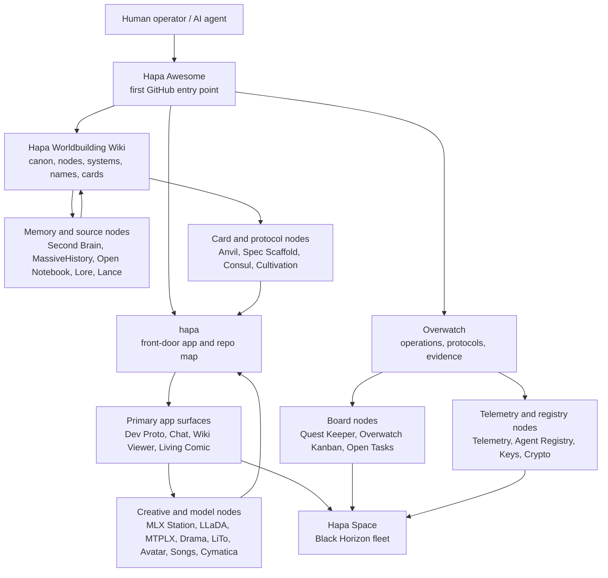

# Hapa Awesome

Hapa is a local-first AI, worldbuilding, media, memory, and agent ecosystem. It is made of small cooperating nodes: each node owns a clear slice of the system, records what it consumes and emits, and links back into the larger canon, operations, and protocol graph.

This repository is the intended first GitHub entry point for Hapa. Start here when you want to understand the full scope of the nodes and systems, the protocol that holds them together, how the nodes relate, and how to use them safely.

Status: this guide links to the current private Hapa GitHub publication set. The last source audit verified 40 published README files, 334 explained related-node links, and 0 broken GitHub README links.

## Hapa Ecosystem Context

  

  
  

Hapa is built as a constellation of modular nodes. Each node owns a focused capability, but participates in a shared protocol for provenance, handoff, cards, memory, and operations.

Every node is designed for both human operators and AI agents. The target contract is three surfaces: a UI for direct human review/control, an API for node-to-node and agent calls, and a CLI for scripted runs, audits, and handoffs. Individual repos may be at different maturity levels, but the public contract is that humans and agents can inspect, operate, and verify the node.

Hapa nodes power AI agents and avatar-agents that build new nodes and enhance existing ones. As work moves through the ecosystem, it is mined for utility, wisdom, and repeatable logic, then distilled into Hapa Cards: portable packets of skills, context, memories, and operational patterns.

Humans and AIs use Hapa Cards to discuss, ideate, prototype, and deploy increasingly complex workflows through a playable, card-collecting mechanic. Collaboration history, skills, work artifacts, and canonical decisions are stored in [hapa-second-brain](https://github.com/calderwong/hapa-second-brain), enriched into [Hapa Worldbuilding Wiki](https://github.com/calderwong/hapa-worldbuilding-wiki) entries, and converted back into cards. Avatar-agents can also be combined or specialized into purpose-built identities with their own storage, lore, canon, card decks, skills, and protocols.

## Start here

If you are new, read in this order:

1. This README for the whole-system map.
2. [docs/START_HERE.md](docs/START_HERE.md) for role-based onboarding paths.
3. [docs/NODES.md](docs/NODES.md) for the complete node catalog.
4. [docs/PROTOCOLS.md](docs/PROTOCOLS.md) for the operating protocols.
5. The README of the node you actually want to run or change.

Core entry points:

- [Hapa](https://github.com/calderwong/hapa) - front-door app/repo for the Hapa workspace and node map.
- [Hapa Worldbuilding Wiki](https://github.com/calderwong/hapa-worldbuilding-wiki) - canon, node notes, systems, names, cards, and vault boundary.
- [Overwatch](https://github.com/calderwong/overwatch) - operations spine: inventory, source index, task inbox, runbooks, and protocols.
- [Hapa Space](https://github.com/calderwong/hapa-space) - Unity Black Horizon fleet surface where nodes become ships and runtime panels.
- [Hapa Dev Proto](https://github.com/calderwong/hapa-dev-proto-private) - main local-first Hapa app lineage.

## What Hapa is

Hapa treats software, canon, personal memory, creative media, and agent work as one loop.

1. Raw source enters the system: notes, videos, chats, code, media, watch history, generated artifacts, or operational evidence.
2. The source is indexed, chunked, summarized, or preserved with provenance.
3. Durable meaning is promoted into wiki pages, cards, names, systems, tasks, or node manifests.
4. Nodes expose capabilities: search, generation, registry, telemetry, tasks, identity, trust, world state, media, and runtime UI.
5. Operators and agents act through protocols, then write evidence back into Overwatch, the wiki, or the owning node.
6. GitHub holds the small source packages and README contracts; private vaults and local stores hold heavy/runtime material.

The result is a working local civilization of tools: a memory graph, a canon graph, a task graph, a media graph, and a set of apps that make those graphs usable.

## Mental model

## The Hapa protocol in one page

The Hapa protocol is not one binary or one server. It is a set of operating rules that make many local nodes act like one trustworthy system.

- Local-first: prefer loopback services, local files, local databases, local model runtimes, and private repositories.
- Source-truth ownership: every artifact should have an owning node, source path or pointer, provenance, and status.
- README contract: each node README explains purpose, inputs, outputs, interfaces, related nodes, and what must stay out of Git.
- Board evidence: work that changes state should leave an Overwatch or Kanban trail: task, action, evidence, result, and next step.
- Canon boundary: drafts, generated outputs, and raw sources do not become canon just because they exist. Promote deliberately.
- Vault boundary: secrets, databases, model weights, generated corpora, large media, raw exports, and runtime state belong in local/vault storage, not GitHub.
- Agent loop: orient, inspect, act narrowly, verify, record evidence, and hand off with links.
- Link hygiene: GitHub READMEs should use working GitHub links for published repos and explain private/local/vault-only boundaries plainly.

See [docs/PROTOCOLS.md](docs/PROTOCOLS.md) for the practical version of each protocol.

## Node families

### 1. Front door, canon, and operations

| Node | Role | Use it when |
| --- | --- | --- |
| [hapa](https://github.com/calderwong/hapa) | Front-door app and high-level repo map. | You need the main orientation, node map, feature parity, or Node Space context. |
| [Hapa Worldbuilding Wiki](https://github.com/calderwong/hapa-worldbuilding-wiki) | Canon and node knowledge graph. | You need lore, systems, names, cards, node notes, or publication boundary docs. |
| [Overwatch](https://github.com/calderwong/overwatch) | Operations spine and source index. | You need task protocols, source inventory, runbooks, or cross-node evidence. |
| [Hapa Quest Keeper](https://github.com/calderwong/hapa-quest-keeper) | Consolidated quest board. | You need a live overview of Hapa app/node boards and coverage status. |
| [Hapa Overwatch Kanban](https://github.com/calderwong/hapa-overwatch-kanban) | Reusable per-project board engine. | You need append-only task/event boards for a node or project. |
| [Hapa Telemetry Node](https://github.com/calderwong/hapa-telemetry-node) | Node discovery and health surface. | You need capability discovery, service status, launchers, or runtime relationship maps. |

### 2. Primary app and user-facing surfaces

| Node | Role | Use it when |
| --- | --- | --- |
| [Hapa Dev Proto](https://github.com/calderwong/hapa-dev-proto-private) | Main local-first Hapa app lineage. | You need cards, local app UI, P2P experiments, media workflows, or app integration. |
| [Hapa Space](https://github.com/calderwong/hapa-space) | Unity Black Horizon fleet MVP. | You need to see nodes as ships, runtime panels, board state, or operator flow in 3D. |
| [Hapa Chat App](https://github.com/calderwong/hapa-chat-app) | Local chat/workroom app. | You need rooms, participants, agents, assets, worker jobs, or conversation inspection. |
| [Hapa Wiki Viewer](https://github.com/calderwong/hapa-wiki-viewer) | Browse the wiki as an app. | You need a local UI for the Markdown wiki instead of raw files. |
| [Hapa Living Comic](https://github.com/calderwong/hapa-living-comic) | Story panel and narrative surface. | You need media-backed narrative panels, story presentation, or comic-style review. |
| [Hapa Spaceship Desktop Hijack](https://github.com/calderwong/hapa-spaceship-desktop-hijack) | Janus/spaceship desktop surface. | You need desktop/world surface experiments tied to Janus and the operator shell. |

### 3. Memory, source, and retrieval

| Node | Role | Use it when |
| --- | --- | --- |
| [Hapa Second Brain](https://github.com/calderwong/hapa-second-brain) | Personal knowledge database and UI. | You need YouTube/reading/watch history, topic groups, claims, taste profiles, or agent context. |
| [Open Notebook](https://github.com/calderwong/open-notebook) | Local research/notebook node. | You need NotebookLM-like source organization, notes, chat, transformations, and podcasts. |
| [MassiveHistory Chunks](https://github.com/calderwong/massivehistory-chunks) | Source-safe pointer package for MassiveHistory chunks. | You need references to the private chunked source archive without publishing payloads. |
| [Hapa Lore Node](https://github.com/calderwong/hapa-lore-node) | Chronicle and canon search node. | You need daily progress, lore, wisdom, and searchable operator history. |
| [Hapa Lance Node](https://github.com/calderwong/hapa-lance-node) | Projection and indexing layer. | You need chunks, embeddings, cards, wiki records, or multimodal index/projection work. |
| [Hapa Wiki Growth Agent](https://github.com/calderwong/hapa-wiki-growth-agent) | Bounded wiki expansion workflow. | You need draft articles, lore dispatches, card drafts, media hooks, or ledgers generated from sources. |

### 4. AI, models, media, and creative generation

| Node | Role | Use it when |
| --- | --- | --- |
| [Hapa MLX Station](https://github.com/calderwong/hapa-mlx-station) | Apple Silicon media-generation station. | You need local image/media generation, hub APIs, or media-node self-tests. |
| [Hapa LLaDA Node](https://github.com/calderwong/hapa-llada-node) | Local LLM/completion node. | You need sovereign LLaDA/MLX completion experiments. |
| [MTPLX](https://github.com/calderwong/mtplx) | Native MTP speculative decoding on Apple Silicon. | You need OpenAI/Anthropic-compatible fast local model serving experiments. |
| [Hapa Drama](https://github.com/calderwong/hapa-drama) | Voice synthesis and narration node. | You need local TTS, voice profiles, DramaBox/Chatterbox/MLX audio adapters, or narration bundles. |
| [Hapa LiTo](https://github.com/calderwong/hapa-lito) | Image-to-3D generation node. | You need Apple LiTo 3D asset runs, provenance-rich 3D cards, or Hapa 3D parity benchmarks. |
| [Hapa Avatar Node](https://github.com/calderwong/hapa-avatar-node) | Avatar/phamiliar generation node. | You need avatar lineage, profile metadata, or phamiliar variant generation. |
| [Hapa Song Registry](https://github.com/calderwong/hapa-song-registry) | Music and song metadata registry. | You need songs, lyrics, timing, Suno/imported audio, or music memory metadata. |
| [Hapa LuminaStem Station](https://github.com/calderwong/hapa-luminastem-station) | 3D/audio stem visualization prototype. | You need stem visualization, spatial audio experiments, or LuminaStem media surfaces. |
| [Cymatica](https://github.com/calderwong/cymatica) | SwiftPM/RealityKit spatial media experiments. | You need spatial audio, stems-to-3D, or RealityKit presentation experiments. |

### 5. Agents, trust, cards, and protocol mechanics

| Node | Role | Use it when |
| --- | --- | --- |
| [Hermes](https://github.com/calderwong/hermes) | Desktop surface for Hermes Agent profiles. | You need human-facing agent installation, profiles, sessions, skills, memory, or provider setup. |
| [Hapa Agent Registry Node](https://github.com/calderwong/hapa-agent-registry-node) | Local agent registry and avatar job broker. | You need agent identity, runtime state, event log projection, or avatar job coordination. |
| [Hapa Keys Node](https://github.com/calderwong/hapa-keys-node) | Local key vault. | You need local provider/node secret management patterns and auth boundaries. |
| [Hapa Crypto Node](https://github.com/calderwong/hapa-crypto-node) | Trust, signatures, and identity primitives. | You need cryptographic proof, signature, identity, or trust-layer experiments. |
| [Hapa Anvil Node](https://github.com/calderwong/hapa-anvil-node) | Card forge and evaluation node. | You need to turn raw card ideas into standardized, evaluated, usable artifacts. |
| [Hapa Janus World Node](https://github.com/calderwong/hapa-janus-world-node) | Local world truth kernel. | You need append-only world events, derived snapshots, or Janus simulation state. |
| [Consul Node Proto](https://github.com/calderwong/consul-node-proto) | Governance/provenance proof harness. | You need Warden, Heap, River, evidence hashing, or environment-up verification prototypes. |
| [Hapa Cultivation Suite](https://github.com/calderwong/hapa-cultivation-suite) | Pulse/cultivation protocol tooling. | You need protocol tooling around cultivation, pulse, and growth workflows. |
| [Hapa Spec Scaffold](https://github.com/calderwong/hapa-spec-scaffold) | Compact protocol/spec/test scaffold. | You need a small starting point for Hapa protocol contracts and tests. |

### 6. Tasks, archives, production records, and historical references

| Node | Role | Use it when |
| --- | --- | --- |
| [Hapa Open Tasks Node](https://github.com/calderwong/hapa-open-tasks-node) | Operational Kanban/task node. | You need task state, Kanban flows, or local project/task service behavior. |
| [Hapa OG](https://github.com/calderwong/hapa-og) | Older integrated Hapa app snapshot. | You need archaeology, reference behavior, prior UX, or older local AI/card patterns. |
| [Huemon Trainer and Thor Production Run](https://github.com/calderwong/2026-05-21-huemon-trainer-thor) | Production-run record. | You need preproduction material, render blockers, or continuation notes for that video run. |
| [Capsule](https://github.com/calderwong/capsule) | Help Fund Hapa capsule artifact. | You need funding/simulator capsule UI reference material. |

For a fuller per-node catalog, see [docs/NODES.md](docs/NODES.md).

## How to use Hapa safely

### For a new human user

1. Read this README.
2. Open [Hapa](https://github.com/calderwong/hapa) for the front-door app map.
3. Open [Hapa Worldbuilding Wiki](https://github.com/calderwong/hapa-worldbuilding-wiki) for canon and publication boundaries.
4. Open [Overwatch](https://github.com/calderwong/overwatch) for operational status and protocols.
5. Pick one node from the catalog and read its README before running anything.

### For an operator

1. Use Overwatch and Quest Keeper to find current work and board state.
2. Use the target node README to find API, CLI, UI, and smoke checks.
3. Run local checks before changing live state.
4. Record evidence in the owning board or node output.
5. Update README links and protocol notes when node relationships change.

### For an AI agent

1. Treat this repository as orientation, not final authority for every node.
2. Inspect the target repo and its README before editing.
3. Keep changes scoped to the owning node.
4. Preserve local/vault/privacy boundaries.
5. Verify with the node's cheap checks first.
6. Record what changed, what passed, and what remains.

## Publication and privacy boundary

Hapa GitHub repos are source packages, not the whole living system. They should contain:

- Human and agent READMEs.
- Small source code and scripts.
- Lightweight schemas, manifests, examples, and pointer files.
- Tests and smoke helpers.
- Small README assets when useful.

They should not contain:

- Secrets, API keys, tokens, or `.node_token` files.
- Live SQLite databases, WAL/SHM files, or local runtime stores.
- Model weights, generated corpora, large media, app bundles, build products, or dependency folders.
- Private raw exports unless explicitly reviewed and approved for publication.

When in doubt, publish a pointer or manifest and keep the payload in the local vault.

## Current verified state

- Published Hapa README files checked: 40.
- README files with related-node sections: 40.
- Explained related-node links: 334.
- Broken GitHub/internal README links: 0.
- Non-GitHub external URLs checked in published READMEs: 28, all reachable at last audit.

## Repository contents

- [README.md](README.md) - broad overview, node families, and first-entry orientation.
- [docs/START_HERE.md](docs/START_HERE.md) - role-based onboarding paths.
- [docs/NODES.md](docs/NODES.md) - complete node catalog with links and explanations.
- [docs/PROTOCOLS.md](docs/PROTOCOLS.md) - practical Hapa operating protocols.
- [data/nodes.json](data/nodes.json) - machine-readable node index for future agents/tools.

## Name

This is called `hapa-awesome` in the GitHub sense: a curated, opinionated, maintained entry point. The point is not to list random links. The point is to make the Hapa system legible enough that a new human or agent can enter through one door, choose the right node, follow the right protocol, and leave the system better documented than they found it.
